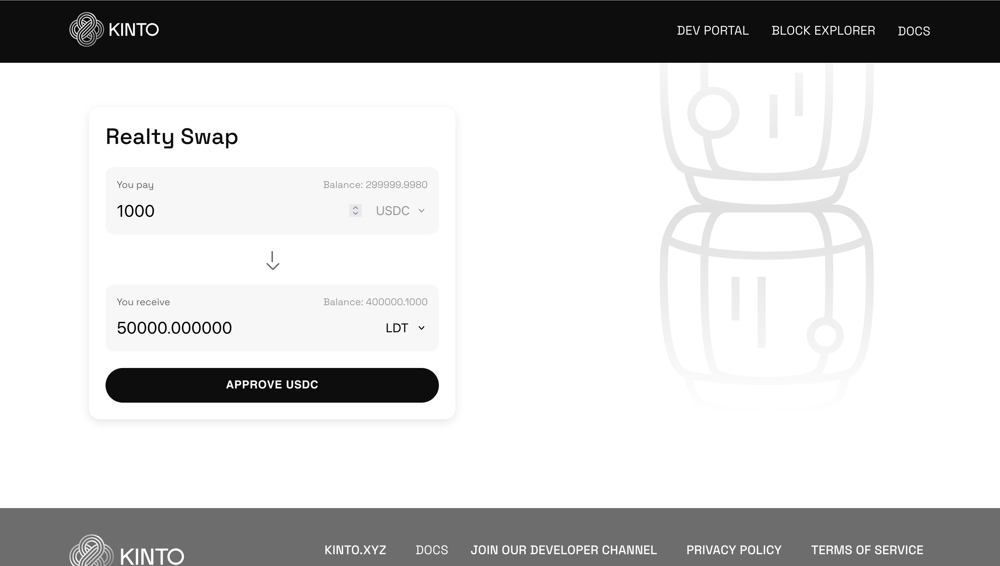

# Tokenized Fractional RWA Marketplace on Kinto



This sample decentralized application demonstrates a fixed-price RWA (Real World Asset) token marketplace using the [Kinto Wallet SDK](https://www.npmjs.com/package/kinto-web-sdk). The app enables users to trade fractional shares of tokenized real-world assets through Kinto's secure Layer 2 solution, featuring a Uniswap-like interface for seamless trading experience.

## Table of Contents

- [Features](#features)
- [Installation](#installation)
- [Usage](#usage)
- [Contract Addresses](#contract-addresses)
- [Links](#links)

## Features

- Fixed-price RWA token marketplace
- Buy and sell fractional RWA tokens with USDC
- Intuitive swap interface similar to Uniswap
- Automated token approval management
- Real-time balance updates
- Price calculations with token decimal handling
- Support for multiple RWA tokens

## Prerequisites

Before using the RWA marketplace, ensure you have:

1. **Kinto Wallet**: Create an account at [Kinto Onboarding](https://engen.kinto.xyz/onboarding)
2. **Test Assets**: You'll need test USDC and RWA tokens for trading
3. **Node.js**: Version 14 or higher

## Installation

1. **Clone the Repository**:
```bash
git clone https://github.com/KintoXYZ/rwa-marketplace
cd rwa-marketplace
```

2. **Install Dependencies**:
```bash
yarn install
```

3. **Set up Local Certificate**:
```bash
brew install mkcert
mkcert -install
mkcert dev.kinto.xyz localhost 127.0.0.1 ::1
```

4. **Configure Local DNS**:
```bash
sudo nano /etc/hosts
# Add: 127.0.0.1   dev.kinto.xyz
```

5. **Start the Application**:
```bash
yarn start
```

## Usage

### Trading RWA Tokens

1. **Connect Wallet**:
   - The app automatically connects to your Kinto wallet

2. **Buy RWA Tokens**:
   - Enter USDC amount
   - Select the RWA token (SRC or LDT)
   - Approve USDC spending if first time
   - Click "Buy" to acquire fractional shares

3. **Sell RWA Tokens**:
   - Click the swap arrow to switch to sell mode
   - Enter the amount of RWA tokens to sell
   - Approve token spending if first time
   - Click "Sell" to convert back to USDC

### Developer Setup

1. **Create Developer Account**:
   - Visit [Kinto Developers](https://engen.kinto.xyz/developers)
   - Deploy the RWA marketplace contract
   - Create your application

2. **Configure Contract Address**:
   - Update `MARKETPLACE_ADDRESS` in `App.tsx` with your deployed contract
   - Update RWA token addresses if using different assets

## Contract Addresses

Current contracts deployed on Kinto testnet:

```typescript
// RWA Marketplace Contract
MARKETPLACE_ADDRESS = "0x7FE6BA5ee1122DA581CC38a805796472613C214B"

// Payment Token
USDC_ADDRESS = "0xcBcc3AF21CAE5Ba7a284bDe8a857b04190CcD29D"

// RWA Tokens
SRC_ADDRESS = "0x28B9786677F2261487494581a73EE724eD2db1f2"  // Sample RWA Token 1
LDT_ADDRESS = "0x5AA66fEf2fFd6c59cB6630a186423a480a064906"  // Sample RWA Token 2
```

## Price Configuration

Fixed prices for RWA tokens:
- SRC Token: 0.03 USDC per share
- LDT Token: 0.02 USDC per share

## Links

- [Kinto Wallet SDK](https://www.npmjs.com/package/kinto-web-sdk)
- [SDK Documentation](https://docs.kinto.xyz/kinto-the-safe-l2/building-on-kinto/development-setup)
- [Developer Portal](https://engen.kinto.xyz/developers)

---

Built with ❤️ using Kinto Wallet SDK. For detailed documentation and support, visit [Kinto Docs](https://docs.kinto.xyz).

## Security Considerations

This marketplace handles real-world asset tokens. Always:
- Verify token addresses
- Check pricing before trading
- Ensure sufficient approvals and balances
- Understand the underlying RWA before trading

## Disclaimer

This is a sample application for demonstration purposes. When implementing a production RWA marketplace, ensure proper:
- Legal compliance
- Asset verification
- KYC/AML measures
- Security audits
- Risk disclosures